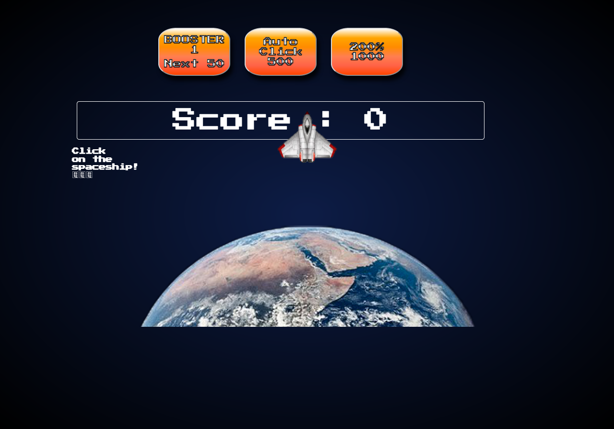

# CookieClicker

Une version stellaire du jeu Cookie Clicker.

## Pincipe du jeu :

Clique sur la fusée pour gagner des points.

En augmentant ton score, tu as la possibilité de débloquer de plus en plus de références geek.

Addiction assurée.

## Collaborateurs :

+ [Guy Djendo](https://github.com/Ho-Be-One)
+ [Mona Marchetti](https://github.com/MonaMarchetti)
+ [Jean Philippe Scheppers](https://github.com/jpscheppers)
+ [Dorothée Weiss](https://github.com/doropro)

## Date :

Effectué entre le 7 et le 14 février 2019, en tant que stagiaires @ [BeCode](https://github.com/becodeorg)

## Langages utilisés :

+ HTML
+ CSS
+ JAVASCRIPT
+ CANVAS

## Progression :

Terminé

## Liens utiles :

+ [Lien vers les consignes](https://github.com/becodeorg/BXL-Johnson-3.9/tree/master/Projets/coockie-clicker)

+ [Lien vers la GitHub Page](https://jpscheppers.github.io/CookieClicker/)

## Aperçu du jeu :

